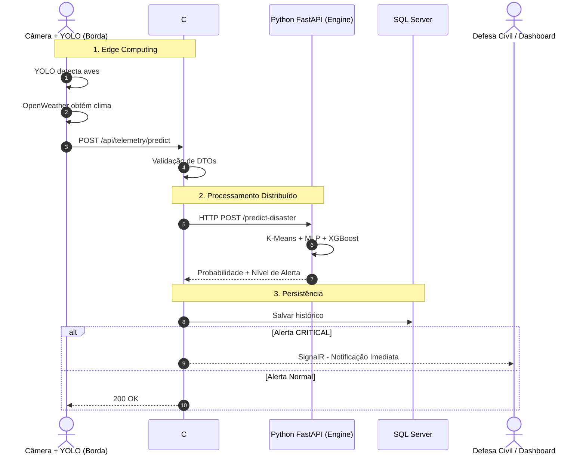

# 🌍 Internet of Animals (IoA) - Predictive Telemetry System


---

# 📖 Visão Geral

O **Internet of Animals (IoA)** é uma plataforma inteligente de monitoramento ambiental que utiliza comportamento animal, telemetria IoT, visão computacional e inteligência artificial para identificar padrões anômalos associados a possíveis desastres naturais.

A premissa do projeto é que diversas espécies possuem elevada sensibilidade a alterações ambientais, geológicas e atmosféricas. Ao combinar essas informações biológicas com sensores modernos e algoritmos preditivos, torna-se possível criar um sistema de alerta precoce capaz de auxiliar autoridades e comunidades em situações de risco.

O sistema integra:

* Biotelemetria de animais monitorados.
* Visão computacional baseada em YOLOv8.
* Dados meteorológicos em tempo real.
* Inteligência Artificial para inferência preditiva.
* Comunicação em tempo real via SignalR.
* Persistência histórica para auditoria e análise.

---

# 📁 Estrutura do Projeto

```text
📁 IoA.Solution/
│
├── 📁 IoA.Api/                     # Projeto principal do C# (BFF)
│   ├── 📁 Controllers/             # Exposição dos endpoints (ex: TelemetryController.cs)
│   ├── 📁 Data/                    # Contexto do Banco e DTOS
│   │   ├── 📁 DTOs/                # Transferência (ex: TelemetryDto.cs, PredictionResponseDto.cs)
│   │   ├── AppDbContext.cs          # Mapeamento do DB e TPH (Herança)
│   │   └── 📁 Interfaces/          # Implementação das Interfaces
│   │   └── 📁 Repositories/        # Implementação do GenericRepository
│   ├── 📁 Hubs/
│   │   ├──AlertHub                  # Hub de alerta para o SignalR
│   ├── 📁 Exceptions/              # Exceções customizadas (ex: SpaceTelemetryException.cs)
│   ├── 📁 Migrations/              # Gerado pelo EF Core
│   ├── 📁 Models/                  # Domínio da aplicação
│   │   ├── 📁 Entities/            # Banco (ex: SpaceEquipment.cs, PredictionHistory.cs)
│   │   └── 📁 ValueObjects/        # Tipos imutáveis (ex: GeoCoordinate.cs)
│   ├── 📁 Profiles/                # Configurações do AutoMapper
│   ├── 📁 Services/                # Regras de Negócio e Interfaces
│   ├── appsettings.json            # ConnectionStrings e Configs
│   └── Program.cs                  # Configuração de DI e Swagger
│
├── 📁 IoA.MachineLearning/
│   ├── main.py
│   ├── train_model.py
│   └── requirements.txt
│
├── 📁 IoA.EdgeGateway/
│   ├── oddysey_yolo.py
│   └── requirements-edge.txt
│
└── README.md
```

---

# ⚙️ Arquitetura do Ecossistema

A solução foi projetada utilizando uma arquitetura distribuída baseada em três componentes independentes.

## 1️⃣ IoA.EdgeGateway (Python - Edge Computing)

Responsável pela coleta e processamento inicial dos dados diretamente no ambiente monitorado.

### Funções

* Captura de vídeo em tempo real.
* Detecção de aves utilizando YOLOv8.
* Rastreamento da quantidade de indivíduos.
* Cálculo de índices de movimentação e agitação.
* Coleta de dados climáticos através da OpenWeather API.
* Fusão dos dados sensoriais.
* Envio assíncrono para a API principal.

### Tecnologias

* Python
* OpenCV
* Ultralytics YOLOv8
* OpenWeather API

---

## 2️⃣ IoA.Api (C# .NET 8 - Backend For Frontend)

Responsável pela orquestração do ecossistema.

### Funções

* Receber dados provenientes da borda.
* Validar regras de negócio.
* Persistir histórico das previsões.
* Integrar-se ao motor de IA.
* Distribuir alertas em tempo real.

### Recursos

#### SignalR

Permite comunicação bidirecional em tempo real entre servidor e clientes.

Quando uma anomalia crítica é detectada:

* Defesa Civil recebe alerta instantâneo.
* Dashboard é atualizado em tempo real.
* Sistemas externos podem ser notificados.

#### Persistência

Utiliza:

* Entity Framework Core
* SQL Server

Com herança baseada em:

```text
SpaceEquipment
├── Satellite
└── BioTelemetryTag
```

Aplicando a estratégia:

```text
Table Per Hierarchy (TPH)
```

### Conceitos POO

* Interfaces
* Injeção de Dependência
* Classes Abstratas
* Value Objects
* Exceções de Domínio
* Polimorfismo

---

## 3️⃣ IoA.MachineLearning (Python FastAPI)

Microsserviço responsável pela inteligência do sistema.

Recebe os dados processados pela API e executa inferências preditivas.

### Pipeline de Machine Learning

#### K-Means

Utilizado para:

* Clusterização comportamental.
* Identificação de grupos de movimentação semelhantes.

#### Multi Layer Perceptron (MLP)

Utilizado para:

* Descoberta de padrões complexos.
* Correlação de múltiplas variáveis ambientais.

#### XGBoost

Responsável pela classificação final.

Produz:

* Probabilidade de desastre.
* Grau de severidade.
* Nível de alerta.

### Tecnologias

* Python
* FastAPI
* Scikit-Learn
* Pandas
* NumPy
* XGBoost

---

# 🔄 Fluxo Completo do Sistema



---

# 🧠 Inteligência Artificial Aplicada

O sistema considera simultaneamente:

* Frequência cardíaca.
* Aceleração corporal.
* Localização geográfica.
* Quantidade de animais observados.
* Índice de movimentação.
* Temperatura ambiente.
* Pressão atmosférica.

Esses atributos são utilizados para identificar padrões compatíveis com:

* Incêndios florestais.
* Atividade vulcânica.
* Deslizamentos de terra.
* Eventos sísmicos.
* Alterações climáticas extremas.

---

# 🛠️ Tecnologias Utilizadas

## Backend

* C# .NET 8
* ASP.NET Core Web API
* Entity Framework Core
* SQL Server
* SignalR
* AutoMapper

## Inteligência Artificial

* Python 3.10+
* FastAPI
* XGBoost
* Scikit-Learn
* Pandas
* NumPy

## Visão Computacional

* Python
* OpenCV
* YOLOv8 (Ultralytics)

## Infraestrutura

* REST APIs
* WebSockets
* Edge Computing
* Arquitetura Distribuída

## Arquitetura e Design

* BFF (Backend For Frontend)
* Clean Architecture
* DDD
* SOLID
* Injeção de Dependência
* POO Avançada

---

# 🚀 Como Executar Localmente

## Pré-requisitos

* .NET 8 SDK
* Python 3.10+
* SQL Server
* Visual Studio 2022 ou VS Code

---

## Passo 1 - Executar o Motor de IA

```bash
cd IoA.MachineLearning
```

Instalar dependências:

```bash
pip install -r requirements.txt
```

Executar a API FastAPI:

```bash
uvicorn main:app --reload --port 8000
```

---

## Passo 2 - Executar a API .NET

Configurar a string de conexão em:

```json
appsettings.json
```

Aplicar as migrações:

```bash
dotnet ef database update
```

Executar:

```bash
dotnet run
```

Swagger:

```text
https://localhost:7123/swagger
```

---

## Passo 3 - Executar o Gateway de Borda

```bash
cd IoA.EdgeGateway
```

Instalar dependências:

```bash
pip install -r requirements.txt
```

Configurar a chave da OpenWeather API.

Executar:

```bash
python oddysey_yolo.py
```

A câmera iniciará o monitoramento e enviará os dados para o ecossistema.

---

# 📡 Exemplo de Payload

```json
{
  "speciesId": "Serinus_canaria_01",
  "latitude": -23.5505,
  "longitude": -46.6333,
  "acceleration": 14.2,
  "heartRate": 320,
  "yoloBirdCount": 5,
  "yoloMovementIndex": 12500.5,
  "pressureHpa": 1013,
  "temperatureC": 25.5
}
```

---

# 🎯 Objetivos do Projeto

* Monitoramento ambiental inteligente.
* Predição de eventos extremos.
* Integração entre IA e IoT.
* Aplicação de Edge Computing.
* Comunicação em tempo real.
* Apoio à tomada de decisão em situações críticas.

---

# 📌 Status do Projeto

🚧 Em desenvolvimento experimental para fins acadêmicos e científicos.

---

# 👨‍💻 Autor

Projeto desenvolvido para a **Global Solution**, com foco em:

* Arquitetura Distribuída
* Inteligência Artificial
* Visão Computacional
* Internet das Coisas (IoT)
* Sistemas de Alerta Ambiental
* Engenharia de Software Avançada
